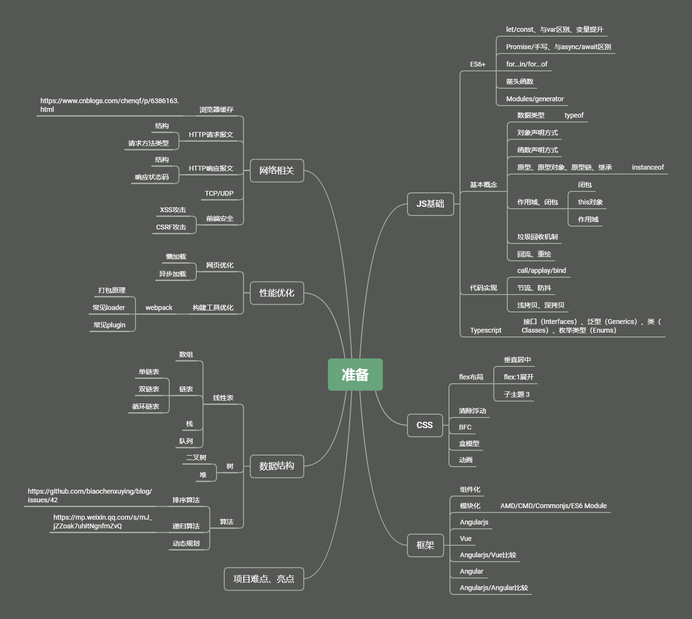
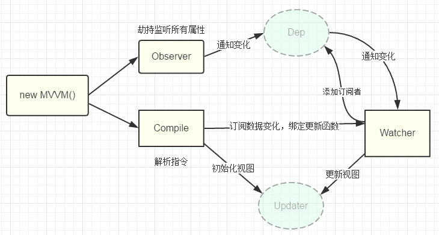

# 2020-04-07
> 大致规划了基于目前自己的前端知识体系，还需要在接下来的时间去不断完善。



## 手写深拷贝

```javascript
  function deepClone (obj = {}) {
    if (typeof obj !== 'object' || obj == null) {
      return obj;
    }
    const target = Array.isArray(obj) ? [] : {};
    for (key in obj) {
      if (obj.hasOwnProperty(key)) {
        target[key] = deepClone(obj[key]);
      }
    }
    return target;
  }
```
# 2020-04-08

> 今天系统地研究了浏览器缓存，基本上理解了浏览器缓存机制，包括缓存类型、缓存位置、缓存优先级及页面刷新对缓存的影响。

参考文章：  
[1] [深入理解浏览器的缓存机制](https://www.jianshu.com/p/54cc04190252)  
[2] [(1.6w字)浏览器灵魂之问，请问你能接得住几个？](https://juejin.im/post/5df5bcea6fb9a016091def69)

> 回流、重绘的学习总结

>  [慕课网-前端JavaScript面试技巧](https://coding.imooc.com/class/400.html)  3/4章 原型和原型链  作用域和闭包

## ES6语法 简易JQuery实现 ：

```javascript
class JQuery {
  constructor (selector) {
    const result = document.querySelectorAll(selector);
    for (let i = 0; i < result.length; i++) {
      this[i] = result[i];
    }
    this.length = length;
    this.selector = selector;
  }
  eq (index) {
    return this[index];
  }
  each (fn) {
    for (let i = 0; i < this.length; i++) {
      const elem = this[i];
      fn(elem);
    }
  }
  on (type, fn) {
    return this.each(elem => {
      elem.addEventListener(type, fn, false);
    })
  }
}
// 插件
JQuery.prototype.test = () => {
  console.log('test');
}
// 复写
class myJQuery extends JQuery {
  constructor(selector) {
    super(selector);
  }
  test () {
    console.log('test');
  }
}
```
## 闭包、自由变量、作用域

  - 闭包有两种表现形式

    - 函数作为参数被传递
    - 函数作为返回值被返回

  - 自由变量的查找，是在函数声明的地方，向上级作用域查找，不是在执行的地方。

## `this`指向 

`this的取值，是在函数执行时确定的`

  - 作为普通函数调用，严格模式下`this`指向`undefined`, 非严格模式下指向`window`

  - 使用`call`/`apply`/`bind`调用，this指向第一个参数绑定的对象

  - 当函数作为对象方法被调用，this指向调用的对象

  - 通过构造函数调用，this指向新创建的对象

  - 在箭头函数中，this是箭头函数上级作用域的this

## 手写call/apply/bind

# 2020-04-09

> 计划 [慕课网-前端JavaScript面试技巧](https://coding.imooc.com/class/400.html)  5-8章

## 手写Vue双向绑定实现
> Vue的双向绑定通过数据劫持结合发布者-订阅者模式来实现的。通过Object.defineProperty()这个方法来劫持各个属性的setter，getter，在getter中收集数据依赖，在数据变动时通过setter方法发布消息给订阅者，触发相应的监听回调。具体的实现:  
> 1. 需要实现一个数据监听器Observer,能够对数据对象的所有属性进行监听，并在数据变动时通知订阅者
> 2. 实现一个指令解析器complier,对每个元素节点进行解析，根据指令模板替换数据，以及绑定相应的更新函数
> 3. 实现一个订阅者Watcher,作为连接Observer和complier的桥梁，能够订阅收到每个属性变动的通知，并执行指令绑定的相应回调函数，从而更新试图。



```javascript
function observer(obj) {
  if (!obj || typeof obj !== "object") {
    return;
  }
  Object.keys(obj).forEach(key => {
    defineReactive(obj, key, obj[key]);
  });
}

function defineReactive(obj, key, val) {
  observer(val);
  var dep = new Dep();
  Object.defineProperty(obj, key, {
    get: function() {
      Dep.target && dep.addSub(Dep.target);
      return val;
    },
    set: function(newVal) {
      if (val !== newVal) {
        val = newVal;
        dep.notify();
      }
    }
  });
}

function Dep() {
  this.subs = [];
}

Dep.prototype = {
  constructor: Dep,
  addSub: function(sub) {
    this.subs.push(sub);
  },
  notify: function() {
    this.subs.forEach(function(sub) {
      sub.update();
    });
  }
};

function Watcher(vm, prop, callback) {
  this.vm = vm;
  this.prop = prop;
  this.callback = callback;
  this.value = this.get();
}

Watcher.prototype = {
  get: function() {
    Dep.target = this;
    const value = this.vm.$data[this.prop];
    Dep.target = null;
    return value;
  },
  update: function() {
    const value = this.vm.$data[this.prop];
    const oldVal = this.value;
    if (value !== oldVal) {
      this.value = value;
      this.callback(value);
    }
  }
};

function Compile(el, vm) {
  this.$vm = vm;
  this.$el = document.querySelector(el);
  if (this.$el) {
    this.$fragment = this.node2Fragment(this.$el);
    this.init();
    this.$el.appendChild(this.$fragment);
  }
}

Compile.prototype = {
  init: function() {
    this.compileElement(this.$fragment);
  },
  node2Fragment: function(el) {
    var fragment = document.createDocumentFragment(),
      child;
    while ((child = el.firstChild)) {
      fragment.appendChild(child);
    }
    return fragment;
  },
  compileElement(el) {
    var childNodes = el.childNodes,
      me = this;
      [...childNodes].forEach(node => {
      var text = node.textContent;
      var reg = /\{\{(.*)\}\}/;
      // 按元素节点方式遍历
      if (me.isElementNode(node)) {
        me.compile(node);
      } else if (me.isTextNode(node) && reg.test(text)) {
        me.compileText(node, RegExp.$1.trim());
      }
    });
  },
  compile(node) {
    var nodeAttrs = node.attributes;
    [...nodeAttrs].forEach(attr => {
      var name = attr.name;
      if (this.isDirective(name)) {
        var exp = attr.value;
        if (name == 'v-model') {
          this.compileModel(node, exp);
        }
        node.removeAttribute(name);
      }
    })
  },
  compileText(node, exp) {
    compileUtil.text(node, this.$vm, exp);
  },
  compileModel(node, exp) {
    compileUtil.model(node, this.$vm, exp);
  },
  isDirective(name) {
    return name.indexOf('v-') === 0;
  },
  isElementNode(node) {
    return node.nodeType === 1;
  },
  isTextNode(node) {
    return node.nodeType === 3;
  }
};

// 指令处理集合
var compileUtil = {
  text: function(node, vm, exp) {
    this.bind(node, vm, exp, "text");
  },
  model: function(node, vm, exp) {
    this.bind(node, vm, exp, "model");
    var val = vm[exp];
    node.addEventListener('input', function(e) {
        var newValue = e.target.value;
        if (val === newValue) {
          return;
        }
        val = newValue;
    });
  }
  // ...省略
  bind: function(node, vm, exp, dir) {
    var updaterFn = updater[dir + "Updater"];
    // 第一次初始化视图
    updaterFn && updaterFn(node, vm[exp]);
    // 实例化订阅者，此操作会在对应的属性消息订阅器中添加了该订阅者watcher
    new Watcher(vm, exp, function(value, oldValue) {
      // 一旦属性值有变化，会收到通知执行此更新函数，更新视图
      updaterFn && updaterFn(node, value, oldValue);
    });
  }
};

// 更新函数
var updater = {
  textUpdater: function(node, value) {
    node.textContent = typeof value == "undefined" ? "" : value;
  },
  modelUpdater: function(node, value) {
    node.value = typeof value == "undefined" ? "" : value;
  }
};

function myVue(options) {
  this.$options = options;
  this.$data = options.data;
  var data = this.$data;
  Object.keys(data).forEach(key => {
    this._proxy(key);
  });
  observer(data);
  this.$compile = new Compile(options.el || document.body, this);
}

myVue.prototype = {
  _proxy: function(key) {
    var me = this;
    Object.defineProperty(me, key, {
      get: function proxyGetter() {
        return me.$data[key];
      },
      set: function proxySetter(newVal) {
        me.$data[key] = newVal;
      }
    });
  }
};
```

## 手写事件监听函数（普通绑定、事件委托）
```javascript
function eventBind(elem, type, selector, fn) {
  if (fn == null) {
    fn = selector;
    selector = null;
  }
  elem.addEventListener(type, event => {
    const target = event.target;
    if (selector) {
      // 事件委托
      if (target.matches(selector)) {
        fn.call(target, event);
      }
    } else {
      // 普通绑定
      fn.call(target, event);
    }
  })
}
```